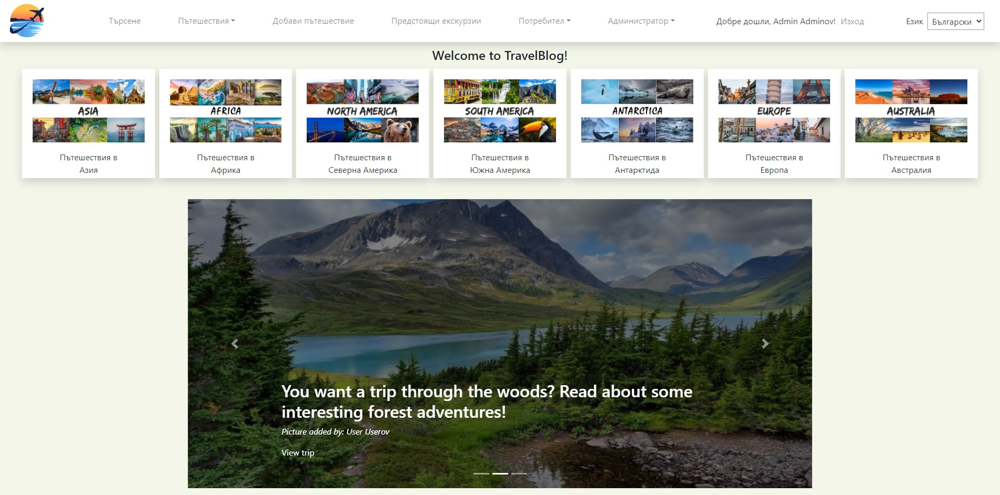

# Welcome to Travel Blog!

**The project depends on the [Future Trips Rest API](https://github.com/vanesazdravkova/Future-Trips)**

Travel Blog is your ultimate destination for sharing and discovering travel experiences. Our platform allows you to effortlessly upload and showcase your trips, from breathtaking landscapes to hidden gems and unforgettable adventures. Whether you're a seasoned traveler or a weekend explorer, you can create detailed posts, upload photos, and see the trips of like-minded wanderers.

  
Table of Contents

  <ol>
    <li>
      <a href="#getting-started">Getting Started</a>
      <ul>
        <li><a href="#perequisites">Prerequisites</a></li>
        <li><a href="#installation">Installation</a></li>
        <ul>
            <li><a href="#run-with-docker">Run with Docker</a></li>
            <li><a href="#run-manually">Run manually</a></li>
        </ul>
      </ul>
    </li>
    <li>
      <a href="#built-with">Built with</a>
    </li>
    <li>
      <a href="#core-features">Core Features</a>
      <ul>
         <li><a href="#accessible-to-everyone">Accessible to Everyone</a></li>
         <li><a href="#visitors-and-newcomers">For Visitors and Newcomers</a></li>
         <li><a href="#registered-members">For Registered Members</a></li>
         <li><a href="#administrators">For Administrators</a></li>
         <li><a href="#universal-features">Universal Features</a></li>
      </ul>
    </li>
    <li><a href="#additional-integrations">Additional Integrations</a></li>
  </ol>

## Getting Started

Please make sure you follow the steps, step by step!

### Prerequisites

* JDK 17
* Apache Maven 4.0.0+
* MySQL

### Installation

You can run the Travel Blog project either with Docker or manually.

#### Run with Docker
In order to run the Travel Blog project with Docker:
1. Navigate to /docker directory where you can find images to start the project and the REST API
2. Execute one of the following commands:
   - docker-compose up
   - docker-compose -f docker-compose-amd.yaml up

#### Run manually
In order to run the Travel Blog project you need to:
1. Download the Travel Blog repo.
2. Connect to MySQL database.
3. Setup the following environment variables:
   - CLAUDINARY_API_KEY=147754227731364; 
   - CLAUDINARY_API_SECRET=xMsZw9MU8kEj6l2b52AZgdONO_A; 
   - EMAIL_PASSWORD=gomy snlo mrsx jcso
4. Start the project on localhost:8080
5. Download the Future Trips REST API.
6. Connect to MySQL database.
7. Setup the already mention variables.
8. Start the REST API on localhost:8081

## Built with
* Java 17
  - Model Mapper
  - Interceptors
  - Internalization (i18n)
  - Validation and Error Handling
  - Mockito
  - Schedulers
* Spring Boot
* Spring Data JPA
* Spring Security
* MySQL
* Thymeleaf Template Engine
* Bootstrap
* JavaScript
* CSS
* HTML
* Apache Maven
* Cloudinary
* Docker
* JavaMailSender
* CriteriaBuilder API

## Core Features

### Accessible to Everyone
- **Explore All Trips:** Browse through all the adventures shared by our community at `/trips/all`.
- **Find Trips by Destination:** Easily filter trips by region with endpoints like `/trips/asian`, `/trips/europen`, `/trips/north-american`, `/trips/south-american`, `/trips/african`, `/trips/australian`, and `/trips/antarctican`.
- **Detailed Trip View:** Get in-depth information on any trip by visiting `/trips/details/{id}`.
- **Search Trips:** Look for trips that match your interests at `/trips/search`.

### For Visitors and Newcomers
- **Sign Up and Activate Account:** Begin your journey with us by registering at `/users/register`. Activate your account via an email verification link.
- **Resend Verification Email:** Misplaced your verification email? Request a new one at `/users/register/sendNewVerificationMailPage`.
- **Recover Forgotten Passwords:** Reset your password securely via an email token with `/password/reset`.

### For Registered Members
- **Create a New Trip:** Share your latest adventure by adding a new trip at `/trips/add`.
- **Edit Your Trip:** Need to update details? Edit your trip at `/trips/edit/{id}` — only available to the trip's owner or an admin.
- **Remove a Trip:** Delete your trip entry at `/trips/delete/{id}`, with permissions restricted to the trip's owner or an admin.
- **Upload Photos:** Add visual memories to your trip at `/trips/details/{id}/picture/add`.
- **Manage Photos:** Delete any uploaded photos at `/trips/details/{tripId}/picture/delete` to the photo owner or admin.
- **Favorite a Trip:** Add or remove trips from your favorites with `/api/trips/{id}/addOrRemoveFromFavorites`.
- **View and Post Comments:** Read comments and share your thoughts on a trip at `/api/{tripId}/comments`.
- **Delete Comments:** Remove your comments from a trip at `/api/{tripId}/comments/{commentId}`, with permissions restricted to the comment owner or an admin.
- **Profile Management:** View and update your profile details at `/users/profile/{id}` and `/users/profile/{id}/editProfile`.
- **Your Uploaded Trips:** See all the trips you’ve shared at `/users/profile/{id}/addedTrips`.
- **Your Uploaded Photos:** View all photos you've contributed at `/users/profile/{id}/addedPictures`.
- **Your Favorite Trips:** Access your list of favorite trips at `/users/profile/{id}/favoriteTrips`.
- **Delete Your Photo:** Remove a photo you've added with `/users/{id}/deletePicture`.

### For Administrators
- **Site Analytics:** Monitor the number of users, trips, and categorize trips by destination with `/statistics`.
- **Future Trip Suggestions:** Manage suggestions provided by the Future Trips REST API, including adding new ones at `/future-trips/add`, viewing all suggestions at `/future-trips/all`, and deleting specific suggestions with `/future-trips/{id}`.

### Universal Features
- **Maintenance Mode:** The site enters maintenance mode nightly from 02:00 to 02:59, redirecting visitors to `/maintenance`.
- **Daily Admin Reports:** Admins receive daily updates on site activity via a scheduled report.
- **Home Page Updates:** The home page content refreshes on every hour to keep the site dynamic and engaging.
- **Automated Cleanup:** Unverified users and expired tokens are automatically removed from the database every 16 minutes.

## Additional Integrations
- **Future Trips REST API:** Enhance your travel planning with trip suggestions and more through a separate service.
- **Cloudinary Integration:** Seamlessly upload and manage trip photos in the cloud.
- **Docker Compatibility:** Deploy the application, REST API, and database effortlessly using Docker images and docker-compose.
- **MapStruct and CriteriaBuilder:** Utilize advanced tools for efficient data mapping and query building.
- **JavaMailSender:** Keep users connected with timely verification and password recovery emails.
- **Fully Responsive Design:** Enjoy a consistent experience across all devices, from desktop to mobile.